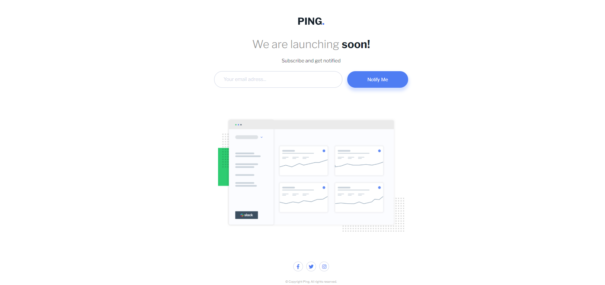
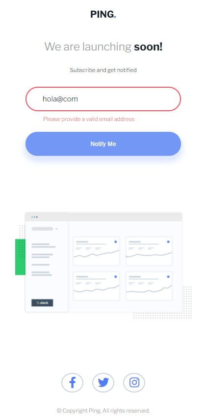

# Frontend Mentor - Ping coming soon page solution

This is a solution to the [Ping coming soon page challenge on Frontend Mentor](https://www.frontendmentor.io/challenges/ping-single-column-coming-soon-page-5cadd051fec04111f7b848da). Frontend Mentor challenges help you improve your coding skills by building realistic projects. 

## Table of contents

- [Overview](#overview)
  - [The challenge](#the-challenge)
  - [Screenshot](#screenshot)
  - [Links](#links)
- [My process](#my-process)
  - [Built with](#built-with)
  - [What I learned](#what-i-learned)
  - [Continued development](#continued-development)
  - [Useful resources](#useful-resources)
- [Author](#author)

**Note: Delete this note and update the table of contents based on what sections you keep.**

## Overview

### The challenge

Users should be able to:

- View the optimal layout for the site depending on their device's screen size
- See hover states for all interactive elements on the page
- Submit their email address using an `input` field
- Receive an error message when the `form` is submitted if:
	- The `input` field is empty. The message for this error should say *"Whoops! It looks like you forgot to add your email"*
	- The email address is not formatted correctly (i.e. a correct email address should have this structure: `name@host.tld`). The message for this error should say *"Please provide a valid email address"*

### Screenshots

:computer: **Desktop**

Desktop - Standard


Desktop - With an empty email input error


:iphone: **Mobile**

Mobile - Standard<br>


Mobile - With wrong email error and button hover<br>


Mobile - Icon hover<br>


### Links

- Solution URL: [Frontendmentor](https://www.frontendmentor.io/solutions/html-css-and-vanilla-js-Kte5bbmLm)
- Live Site URL: [GitHub Page](https://reykjabik.github.io/Ping-coming-soon-page/)

## My process

### Built with

- Semantic HTML5 markup
- CSS custom properties
- Responsive web design
- Mobile-first workflow

### What I learned

I have put into practice more **responsive designs** than in previous challenges. Before this one, I gave all my card components fixed sizes (375px for mobile, 1440px for desktop) and crafted everything else according to those sizes (buttons, paragraphs...).

I realized that even if the newbie challenges are very simple and fixed sizes are ok for this, in the real world we need more than this. Having a look at my designs at an intermediate width (say, 800px), they started looking awkward. 

Too much empty space on the sides...

Small buttons...

And so on...

I found the perfect tool to control the size of some elements (like buttons and fonts) for the range between mobile and desktop: `clamp`. One example for my `<h1>`:

```font-size: clamp(1.25rem, 3.5vw, 2.25rem);```

This sets a minimum (1.25rem), maximum (2.25rem), and ideal size (3.5vw). It will never shrink further than 1.25rem, it will never grow over 2.25rem, and any time the screen size is between these sizes, the **h1** will adapt to it, exactly at 3.5vw.

I find this *ideal size* a tricky thing to get, and it's taken me a bit of hit and miss.

In the same line, I am trying to focus on setting minimum and maximum widths or heights, rather than fixed ones. This I learned from [Kevin Powell](https://www.youtube.com/watch?v=bn-DQCifeQQ) and I think this way your designs become much more powerful in terms on responsiveness.

### Continued development

I still feel my CSS is a bit messy, with a few lines repeating here and there yet with some differences. For instance, things like:

```
display: flex;
flex-direction: row;
justify-content: center;
align-items: center;
```

and

```
display: flex;
flex-direction: column;
justify-content: center;
align-items: center;
```

Almost the same code, just one line of difference. I know I can just create two classes, for instance, `flex-r` for flex row and `flex-c` for flex column, and asign them to the corresponding elements. 

Once the project is finished I can see this more clearly, but while coding it not so much. This example with flex is probably very clear, but some other properties I don't feel ready to abstract that much.

I would also like to use more variables, especially when it comes to sizes. I feel that I end up having heaps of amounts of rems, and perhaps I could try to create some `--paragraph-sm/md/lg` types of variables for these.

From what I have heard and I have started to see **Tailwind CSS** might help me better structure my CSS code, since it arranged it all into different customizable classes.

### Useful resources

- [Media queries, at the end?](https://stackoverflow.com/questions/62047994/is-it-best-to-group-similar-media-queries-at-the-end-of-the-css-or-to-just-keep) - I normally put them all at the end, but I have seen them all over the CSS code as well. This helped me answer my questions.
- [Responsive Design Made Easy - Kevin Powell](https://www.youtube.com/watch?v=bn-DQCifeQQ) - I kept coming to this to made my design much more fluid, rather than having two different fixed sizes.
- [JavaScrip Client-side Form Validation - Florin Pop](https://www.youtube.com/watch?v=rsd4FNGTRBw&t=894s) - I had to come back again to this video to improve some messy performance of my initial form. 

## Author

- Frontend Mentor - [@reykjabik](https://www.frontendmentor.io/profile/Reykjabik)
- Twitter - [@strangerin_](https://www.twitter.com/strangerin_)
